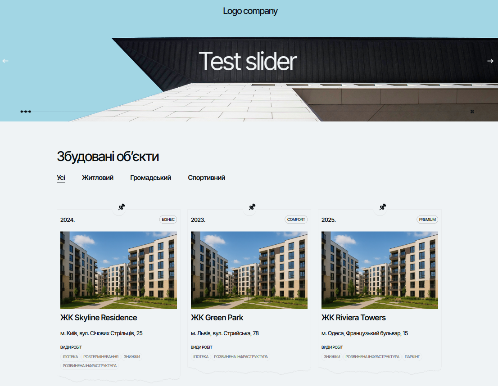
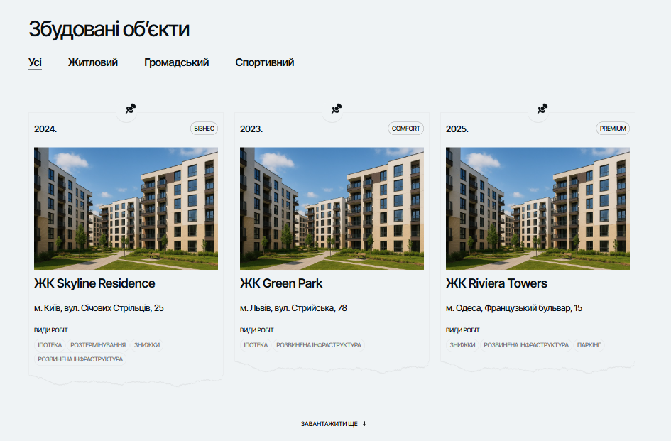

# 🚐 Text Smart Orange —  Test Task

A small project completed as a test assignment based on the

🔗 [Live Demo](https://sofi-dobriak.github.io/smart-orange/)

---



✨ Implemented
  - 📄 Projects pagination with data loading via Axios
  - 🎞️ Slider built with Swiper
  - ⚡ Fast build and dev server using Vite
  - 💅 Responsive layout with HTML + CSS



---

## 🛠️ Tech Stack
   - Vite
   - HTML
   - CSS
   - Vanilla JavaScript (ESM)
   - Swiper
   - Axios


---

## 🚀 Run Locally

1. Clone the repository:
   ```bash
   git clone https://github.com/sofi-dobriak/smart-orange.git
2. Navigate to the project folder:
    ```bash
    cd smart-orange
3. Install dependencies:
    ```bash
    npm install
4. Start the development server:
    ```bash
    npm run dev

5. Open in your browser:
    ```bash
    http://localhost:5173
---

👩‍💻 Author: Sofi Dobriak